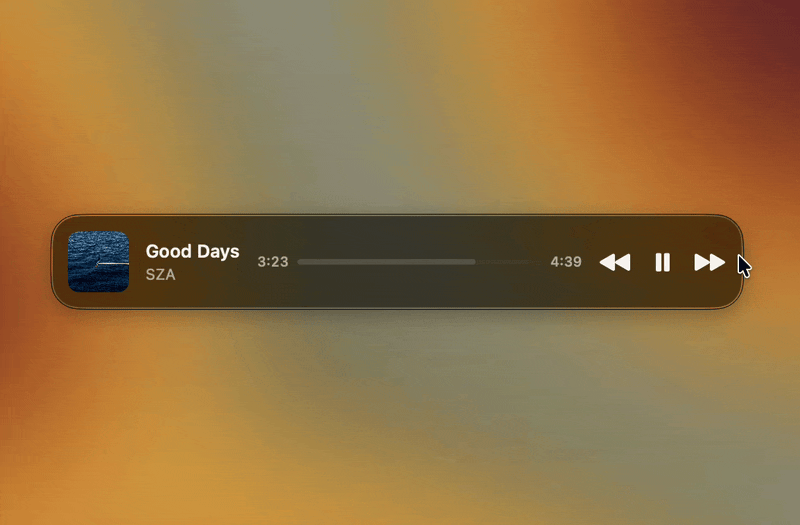
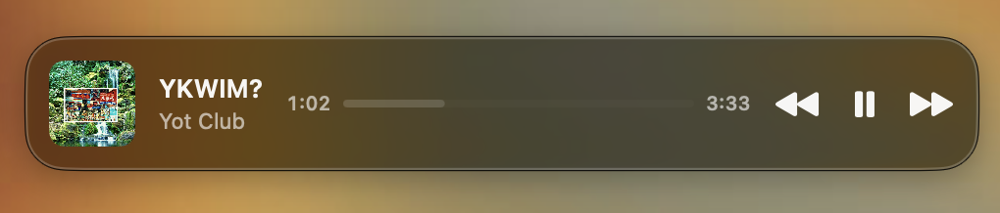
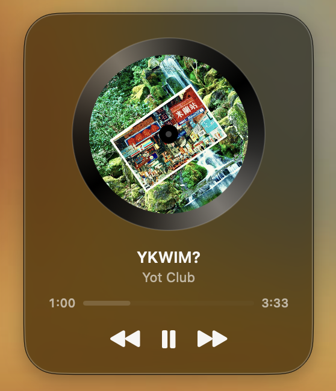
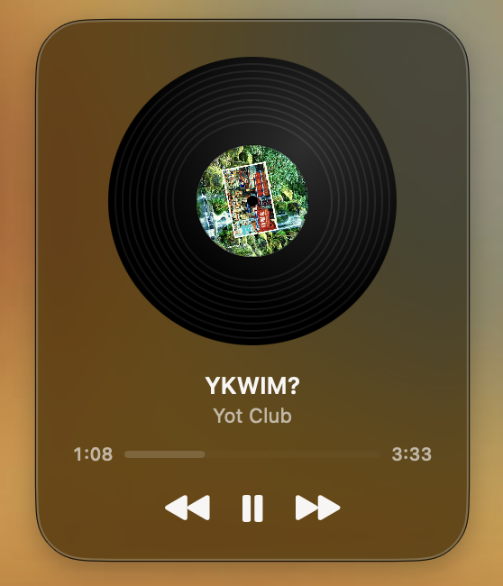
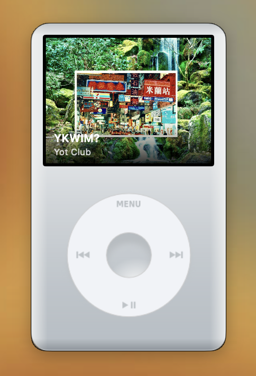
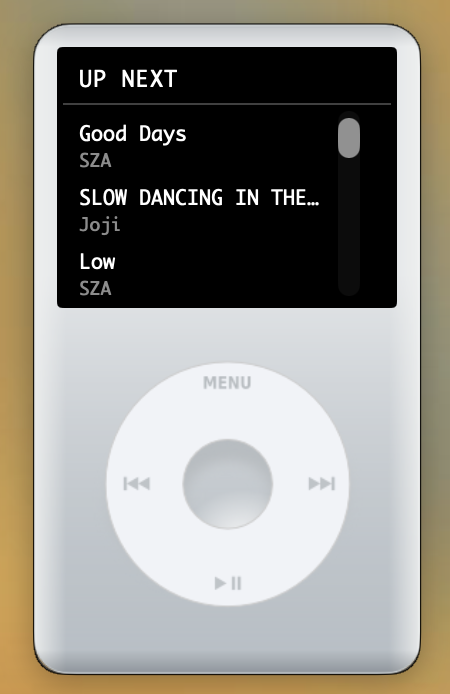

# Miniplayer

[](https://github.com/shazibid/miniplayer/actions/workflows/ci.yml)
[](LICENSE)

A floating now-playing widget for macOS. It shows what's playing in
**Spotify** or **Apple Music**, lets you skip and pause without switching
apps, and comes in four skins: a Liquid Glass pill, a spinning CD, a spinning
vinyl record, and a click-wheel iPod.

It has no Dock icon and no menu bar item. It's one small borderless window
that stays on top of everything else.

Not affiliated with, or endorsed by, Apple or Spotify.

<p align="center">
  
</p>
<p align="center">
  
</p>
<p align="center">
  
  
  
  
</p>

## At a glance

- Shows the current track's title, artist, artwork, and elapsed/total time.
- Play/pause, next, and previous.
- Follows whichever app is playing (Spotify or Apple Music) automatically.
- Four skins, chosen from a right-click menu.
- Long titles scroll, and the title and artist lines scroll in sync.
- Minimizes to the Dock as a live thumbnail.
- Remembers your skin, position, and pill width between launches.
- iPod skin: an "Up Next" queue screen (Apple Music out of the box, Spotify
  after you connect your account).

## Skins

| Skin | Size | What it is |
| --- | --- | --- |
| **Glass Pill** | 320×68, width adjustable | A slim Liquid Glass bar. Drag its left or right edge to stretch it (260–640 pt). At 420 pt or wider it also shows a progress bar. |
| **CD Player** | 240×300 | Album art as a disc that spins while playing, with title, artist, progress, and controls below. |
| **Vinyl Record** | 240×300 | A spinning record with the artwork as the label. Same layout as the CD. |
| **iPod** | ≈193×325 | A click-wheel iPod with a working wheel and a now-playing / "Up Next" screen. |

Switch skins from the right-click menu. The window animates between sizes.

## Controls

| To do this | Do this |
| --- | --- |
| Move the widget | Drag it by its background |
| Change skin | Right-click → pick a skin |
| Play / pause, next, previous | Click the buttons. On the iPod: bottom or center of the wheel = play/pause, left = previous, right = next |
| Show the queue (iPod only) | Click the top of the wheel. Click again to go back |
| Resize (Pill only) | Drag its left or right edge |
| Minimize | Right-click → **Minimize**. Click the Dock tile to bring it back |
| Quit | Right-click → **Quit** |

## What works with which app

| | Spotify | Apple Music |
| --- | --- | --- |
| Title, artist, artwork, elapsed/total time | Yes | Yes |
| Play/pause, next, previous | Yes | Yes |
| "Up Next" queue (iPod skin) | Only after **Connect Spotify Account** (see below) | Yes, the next 15 tracks of the current playlist |

When both apps are open, whichever one is playing wins. If neither is playing,
the widget shows Spotify first, then Music. If neither is running, it shows
"Nothing playing" and the controls are disabled.

Not supported: seeking, volume, shuffle/repeat, or browsing a library. The
progress bar is display-only.

## Requirements

- **macOS 26 (Tahoe) or later.** The Glass Pill uses the Liquid Glass
  `glassEffect` API, and the package targets `.macOS(.v26)`.
- **Xcode 26 / Swift 6.2** to build.
- Spotify and/or Music.app.

## Install

There are no prebuilt releases yet, so you build from source.

```bash
git clone https://github.com/shazibid/miniplayer.git
cd miniplayer
swift run Miniplayer
```

The first build takes a minute or two. The widget then appears in the top-right
corner of your main display.

### Build a standalone app

```bash
./Packaging/build-app.sh
```

This produces `dist/Miniplayer.app`. Drag it into `/Applications`.

The app is **ad-hoc signed and not notarized**, so macOS blocks it the first
time. Right-click the app, choose **Open**, then confirm. After that it opens
normally.

The project also opens in Xcode (via `Package.swift`) or VS Code with the Swift
extension. `.vscode/launch.json` has debug and release configurations.

## First-run setup

### Allow Automation (required)

Miniplayer reads and controls Spotify and Music through AppleScript. The
first time it talks to each app, macOS asks for permission. Allow both.

If you denied one by mistake, re-enable it in **System Settings → Privacy &
Security → Automation → Miniplayer**. Without it the widget shows "Nothing
playing" even while music is playing.

### Connect Spotify (optional, for the iPod queue only)

Spotify's AppleScript interface can't report a queue. To see Spotify's "Up
Next" list on the iPod skin, connect your account:

1. Right-click → **Connect Spotify Account…**
2. Approve access in the browser window that opens.
3. The widget stores a refresh token and you stay connected.

Right-click → **Disconnect Spotify Account** removes it.

> **Heads-up:** the Spotify app this project uses is in Spotify's *Development
> Mode*, which only allows a small list of manually approved accounts. If
> you're not on that list, Spotify's consent page will reject you and the
> connect step will time out. Everything else (now playing, controls, all four
> skins, Apple Music including its queue) works without a Spotify account.
> Supporting your own Spotify app is on the roadmap.

Details, for the curious:

- Login is OAuth Authorization Code with PKCE. There's no client secret. A
  short-lived server on `127.0.0.1:8888` catches the redirect.
- Scopes requested: `user-read-currently-playing` and
  `user-read-playback-state`. The app can't change your playback through the
  Web API.
- The queue only shows if Spotify says this Mac is the active playback device.
  If your phone or a speaker is driving playback, the iPod screen says "Playing
  on another device" instead of showing the wrong queue.

## Command line

```bash
swift run Miniplayer --print-queue
```

Prints Spotify's upcoming queue as JSON (`name`, `artist`) and exits, without
opening a window. It needs Spotify running and your account connected. If the
active device isn't this Mac it prints `[]` and explains why on stderr.

## Data and privacy

- **Stored on your Mac:** your skin, window position, and pill width in the
  app's `UserDefaults`, and, only if you connect Spotify, a refresh token at
  `~/Library/Application Support/Miniplayer/spotify-refresh-token` (file mode
  `0600`, folder mode `0700`).
- **Network:** Spotify album art is downloaded from the URL Spotify's app
  provides. If you connect Spotify, the app also talks to
  `accounts.spotify.com` and `api.spotify.com`. Nothing else.
- Apple Music artwork and metadata never leave the machine.

## Development

### Tests

**Unit tests** (XCTest through SwiftPM, in `Tests/MiniplayerTests`) cover
active-source selection, skin and window persistence, AppleScript response
parsing for both apps, PKCE, the OAuth loopback server, Spotify token storage,
and the Web API queue matching. They don't need Spotify or Music running.

```bash
swift test --filter MiniplayerTests
```

**E2E UI tests** (`MiniplayerUITests.xcodeproj`, XCUITest) drive the real
app: skin switching, playback buttons, and the now-playing labels. XCUITest
can't run inside a plain `swift test` bundle, hence the separate Xcode
project. The tests launch a debug build with `MINIPLAYER_UI_TEST=1`, which
swaps in a fake player (`FakeMediaAppController`) so no real Spotify or Music
is needed. That fake is `#if DEBUG` only and never compiled into release
builds.

```bash
./Packaging/build-app.sh --debug   # builds dist/Miniplayer-Debug.app
xcodebuild test -project MiniplayerUITests.xcodeproj -scheme MiniplayerUITests -destination 'platform=macOS'
```

The first run on a Mac needs Accessibility permission for whatever process is
driving the tests (System Settings → Privacy & Security → Accessibility).

**CI** (`.github/workflows/ci.yml`) builds and runs the unit tests on every
push and PR. That job is the merge gate. The E2E job also runs but is still
advisory (`continue-on-error`) until it has stayed green for a few more PRs.

### How it works

- **Polling.** `PlayerViewModel` polls every second on a background task. Each
  registered `MediaAppController` (`SpotifyController`, `AppleMusicController`)
  reports whether its app is running, plus its state, track, and playback
  position. The one that's playing wins.
- **AppleScript, not SDKs.** Both controllers use `NSAppleScript`, the same
  scripting dictionaries Script Editor uses. Spotify returns an artwork URL that
  the widget downloads. Music.app only exposes raw artwork bytes.
- **The window.** A borderless, floating, all-Spaces `NSWindow` hosting SwiftUI.
  Skin changes animate the window frame and the SwiftUI content together.
- **Text scrolling.** `MarqueeText` scrolls titles that don't fit. A shared
  `MarqueeSync` makes sibling lines (title and artist) rest and restart
  together.
- **Spotify queue.** `SpotifyAuthManager` runs the PKCE login, `SpotifyTokenStore`
  keeps the refresh token in a permission-locked file (not the Keychain, whose
  code-signature check would re-prompt on every debug rebuild), and
  `SpotifyWebAPI` fetches `/me/player/queue` and discards it if the active
  device isn't this Mac.

### Project structure

```
Sources/Miniplayer/
├── main.swift                     # App entry, window setup, --print-queue
├── PlayerViewModel.swift          # Polling, source selection, playback actions
├── MediaAppController.swift       # Controller protocol + Track/QueueTrack/PlayerState models
├── SpotifyController.swift        # Spotify AppleScript bridge
├── AppleMusicController.swift     # Music.app AppleScript bridge
├── WidgetSkin.swift               # Skin enum, sizes, persisted skin/position/pill width
├── RootView.swift                 # Skin switch + right-click menu
├── PillView.swift                 # Glass Pill skin
├── RotatingCDView.swift           # CD skin
├── VinylView.swift                # Vinyl skin
├── SpinningDiscSkin.swift         # Shared layout for CD + Vinyl
├── IPodView.swift                 # iPod skin (now playing + queue screen)
├── PlaybackControlButtons.swift   # Shared back / play-pause / forward row
├── PlaybackProgressView.swift     # Shared elapsed / bar / duration readout
├── MarqueeText.swift              # Scrolling text
├── MarqueeSync.swift              # Keeps sibling marquee lines in step
├── AccessibilityID.swift          # Identifiers used by the E2E tests
├── Testing/FakeMediaAppController.swift  # #if DEBUG fake player
├── Spotify/                       # Auth config, PKCE login, token store, loopback server, Web API
└── Resources/ipod-body.png        # iPod artwork

Tests/
├── MiniplayerTests/              # Unit tests (swift test)
└── MiniplayerUITests/            # E2E sources (run via MiniplayerUITests.xcodeproj)

Packaging/
├── build-app.sh                   # Builds dist/Miniplayer(-Debug).app
├── Info.plist                     # Bundle ID, version, permission text
└── AppIcon.icns                   # Placeholder icon
```

## Known limitations

- macOS 26+ only. There's no fallback for the Glass Pill on older systems yet.
- Spotify's queue needs an approved account (see the Development Mode note
  above) and only appears when this Mac is the active device.
- The queue is only shown in the iPod skin.
- Apple Music support is local-only. There's no Apple Music API, and radio or
  algorithmic playback has no queue to show.
- Only the Pill can be resized. Progress is display-only, with no seeking.
- The app is ad-hoc signed and not notarized, so first launch needs
  right-click → Open.
- `Packaging/AppIcon.icns` is a placeholder made from the iPod skin's artwork.

## Roadmap

Planned or under consideration (see [TODO.md](TODO.md) for the full list):

- A user-supplied Spotify client ID, so anyone can connect regardless of
  Spotify's Development Mode cap.
- A fallback look for macOS versions without Liquid Glass.
- iPod stickers and an editor for customizing the iPod.
- An "Open Spotify" button and volume control.
- Signed and notarized releases.

## License

[MIT](LICENSE)
